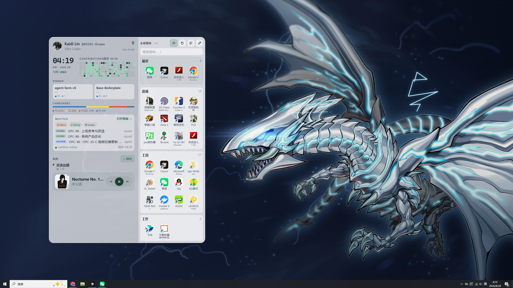
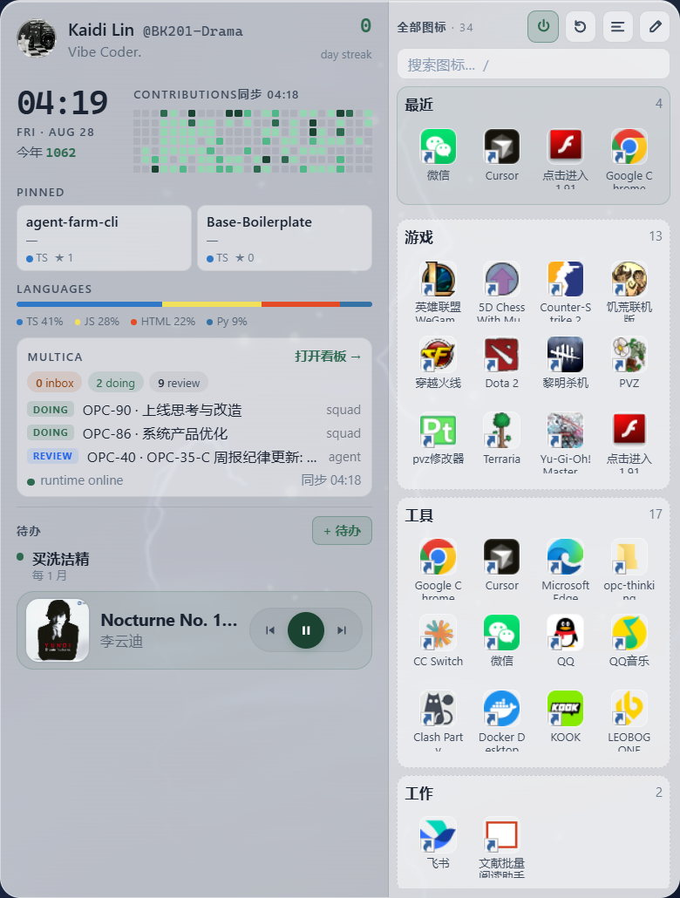
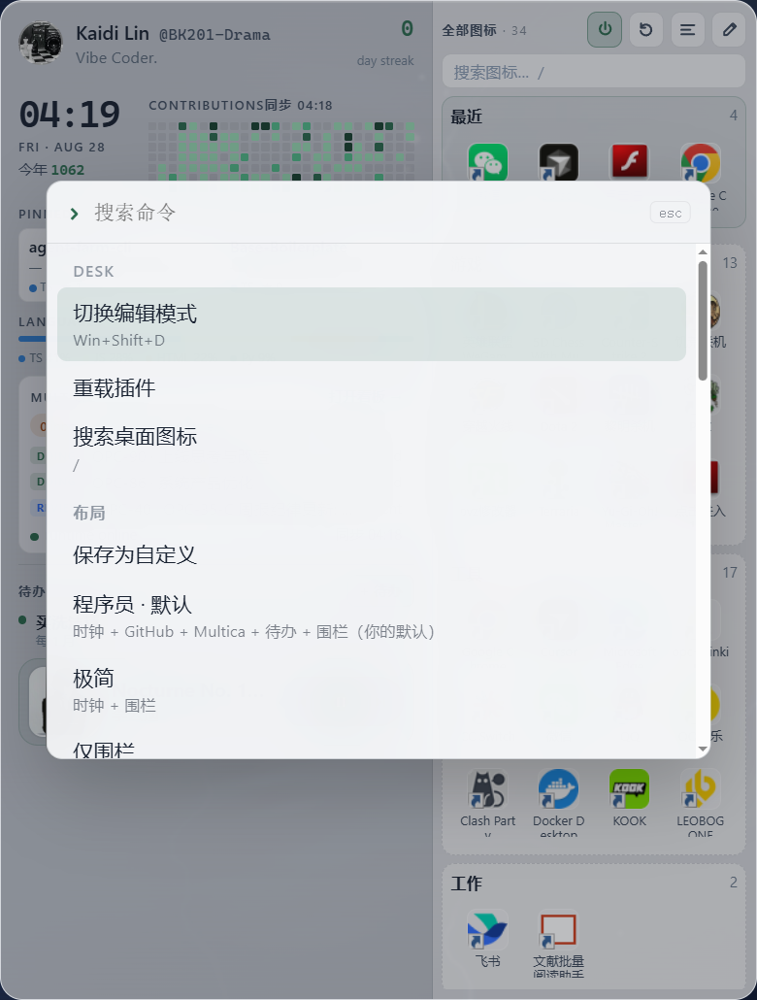

# desk

Windows 桌面玻璃看板 —— 把常用信息与桌面图标收进一块常驻底栏。

用 **Tauri 2 + WebView2** 做透明置底窗口：GitHub 贡献、本地 Multica 看板、待办、QQ 音乐卡片，以及接管后的桌面图标围栏。面板可热插拔，布局可一键切换。

<p align="center">
  
</p>

<p align="center">
  
  &nbsp;
  
</p>

## 功能

- **围栏**：把桌面图标收到 vault，分类展示、搜索、最近启动
- **GitHub**：贡献热力、置顶仓库、语言占比（token 只存本机）
- **Multica**：读本地看板摘要（需本机 Multica 在跑）
- **待办**：轻量提醒列表
- **QQ 音乐**：系统媒体会话 + 多媒体键播控；点封面拉前台
- **布局预设**：程序员 / 极简 / 仅围栏 / 自定义
- **命令面板**：全局快捷键打开；插件用 switch 开关

## 环境

- Windows 10/11 + WebView2
- Node.js 18+、Rust（[Tauri 前置](https://v2.tauri.app/start/prerequisites/)）

## 开发

```bash
npm install
npm run tauri:dev
```

## 构建

```bash
npm run tauri build
```

产物大致在：

- `src-tauri/target/release/desk.exe`
- `src-tauri/target/release/bundle/nsis/` 或 `msi/`

安装或运行 release 后可开开机自启；板内可随时关掉。

## 快捷键

| 快捷键 | 作用 |
|--------|------|
| `Ctrl+Shift+K` / `Win+Shift+K` | 命令面板 |
| `Win+Shift+D` | 编辑模式 |
| `/` | 围栏内搜索图标 |

desk 置底时普通 `Ctrl+K` 常收不到，所以用带 `Shift` 的全局热键。

## 插件

看板由插件填充左右栏与 overlay。

**用户插件目录：** `%LOCALAPPDATA%\desk\plugins\<id>\`

```
manifest.json
panel.js      # ESM：export default { mount, unmount? }
panel.css     # 可选
```

启用列表：`%LOCALAPPDATA%\desk\plugins.json`。

> 插件等于本机代码，不要加载不可信目录。

## 配置与隐私

敏感信息**不会**进仓库，只落在本机：

| 文件 | 用途 |
|------|------|
| `%LOCALAPPDATA%\desk\github.json` | GitHub token（也可 `gh auth` / 环境变量） |
| `%LOCALAPPDATA%\desk\multica.json` | Multica API token |
| `%LOCALAPPDATA%\desk\plugins.json` | 布局与禁用列表 |
| `%LOCALAPPDATA%\desk\vault\` | 围栏接管的桌面文件 |
| `%LOCALAPPDATA%\desk\reminders.json` | 待办 |

围栏启动后会清空用户/公共桌面上的项目并移入 vault；右上角可**还原**。

## 说明

- desk 是本机桌面窗，不是服务，不适合 Docker 跑
- Multica / GitHub 连不上时对应面板会降级提示，不影响围栏

## License

MIT
